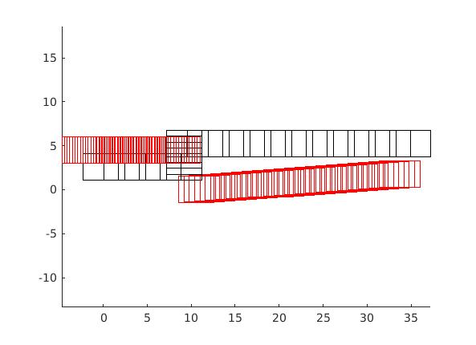

# A demo 3-D A* search for vehicle planning

## 方法

直接扩展时间维度使得整个网格变为 $(x,y) \to (x,y,t)$，并且限制 $t$ 单调增加；依然采用传统的 A* 算法。

## 结果

初步可以实现动态障碍物避障，如下图

 

但是由于算法架构过于简单，没有考虑**车辆本身的动力学和运动学约束**和诸如车辆本身并不能后退，可能得到很多不合理的结果，如：

## 进一步方案

进一步考虑依据[3]对于算法进行进一步设计，此外还需要考虑车辆的特定约束，比如可以采用 *Hybrid Astar* 的方案，这也在百度的 [Open Space Planner](https://github.com/ApolloAuto/apollo/blob/master/docs/specs/Open_Space_Planner.md)中的停车等被采用，但三维搜索下此方案的效率显然不乐观，可能需要新的方法。

可以参考的 Python实现 [Space-Time-AStar](https://github.com/GavinPHR/Space-Time-AStar) 的方案

## More

...

**参考文献**

1. [Introduction to the A* Algorithm](https://www.redblobgames.com/pathfinding/a-star/introduction.html)

2. [Amit’s A* Pages](http://theory.stanford.edu/~amitp/GameProgramming/)

3. [David Silver-Space time A star](https://www.davidsilver.uk/wp-content/uploads/2020/03/coop-path-AIWisdom.pdf)

   